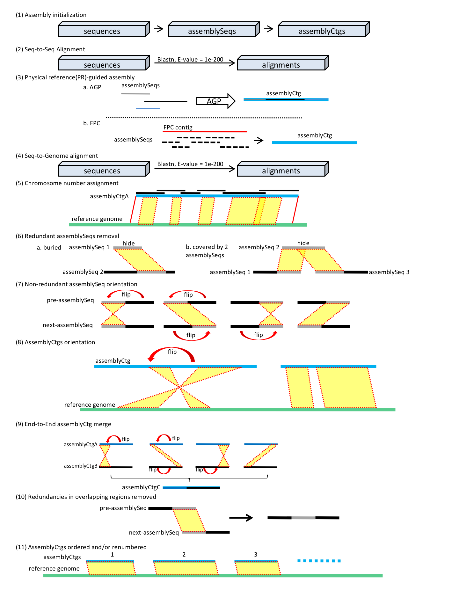
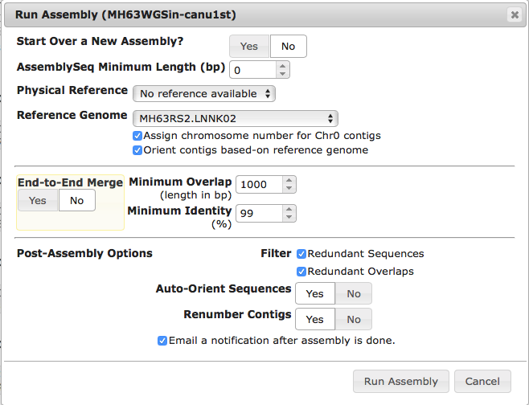
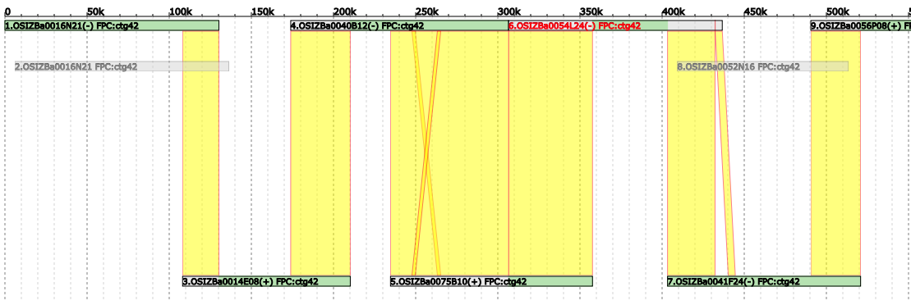
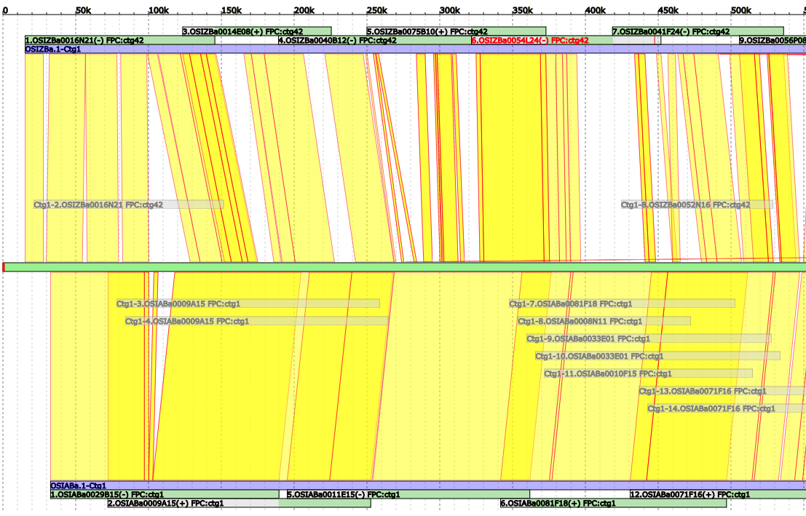
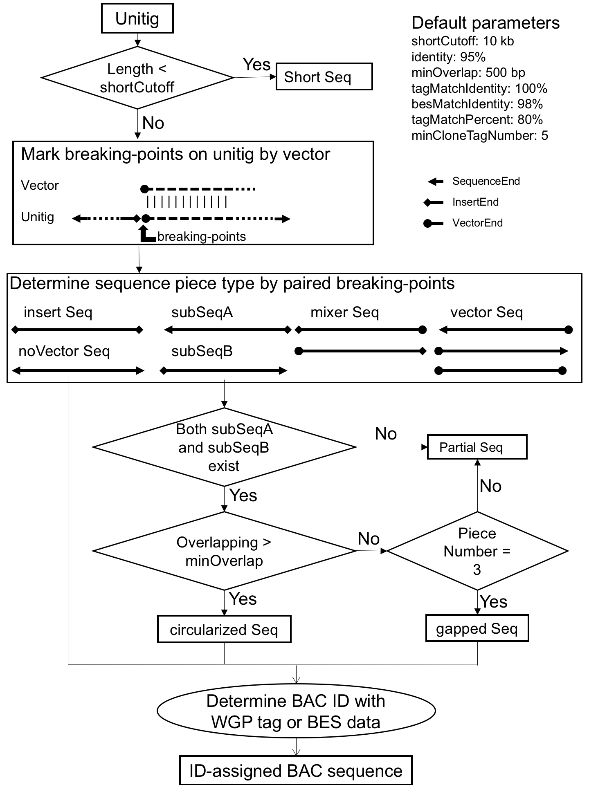

# [Pangu LIMS Docs](README.md)
## Genome Puzzle Master Manual

### GPM Workflow
- Upload Subject and Reference Genomes.
- Run preliminary alignments of each subject Genome to the Reference.
- Run an assembly of each Genome.
- “Clean Up” each Chromosome for the assemblies.
- Fill any possible gaps using alternative assemblies of the same subject.  
- Eliminate any identifiable contamination.  

### [GPM Basic User Guide](GPM-Userguide.md)
- [GPM Main Interface](GPM-Userguide.md#gpm-main-interface)
- [Uploading A New Genome](GPM-Userguide.md#uploading-a-new-genome)
- [Running Preliminary Alignments](GPM-Userguide.md#running-preliminary-alignments)
- [Creating a Project and Assigning Genomes](GPM-Userguide.md#creating-a-project-and-assigning-genomes)
- [Creating an Assembly](GPM-Userguide.md#creating-an-assembly)
- [Running an Assembly](GPM-Userguide.md#running-an-assembly)
- [Chromosome View](GPM-Userguide.md#chromosome-view)
- [“Cleaning Up” and Moving Contigs](#cleaning-up-and-moving-contigs)
- [Contig View](GPM-Userguide.md#contig-view)
- [Gap Filling and Merging Contigs](GPM-Userguide.md#gap-filling-and-merging-contigs)
- [Breaking Contigs](GPM-Userguide.md#breaking-contigs)
- [Flipping Contigs](GPM-Userguide.md#flipping-contigs)
- [Alignment Checker](GPM-Userguide.md#alignment-checker)
- [Unplaced Contigs](GPM-Userguide.md#unplaced-contigs)
- [Troubleshooting](GPM-Userguide.md#troubleshooting)

### GPM assemblyRun
- AssemblyRun operations

- Screenshot of assemblyRun interface

### Visualization of typical available data in GPM
- GPM assemblyCtg view of a 500-KB region

> 
> AssemblySeqs, top and bottom, are shown as overlapping (yellow) and fully redundant assemblySeqs are gray. The retained (green) and removed (gray) portions of assemblySeqs are indicated.

- Chromosome-scale view of a 500-KB region that compares two genome assemblies to a Reference sequence

> 
> The Reference Sequence is shown in the middle (bright green) with alignments (yellow) to each assemblyCtg (violet) at the top and bottom. The assemblyCtg order can be changed by drag-and-drop.

### Flowchart for processing unitigs with postHGAP

